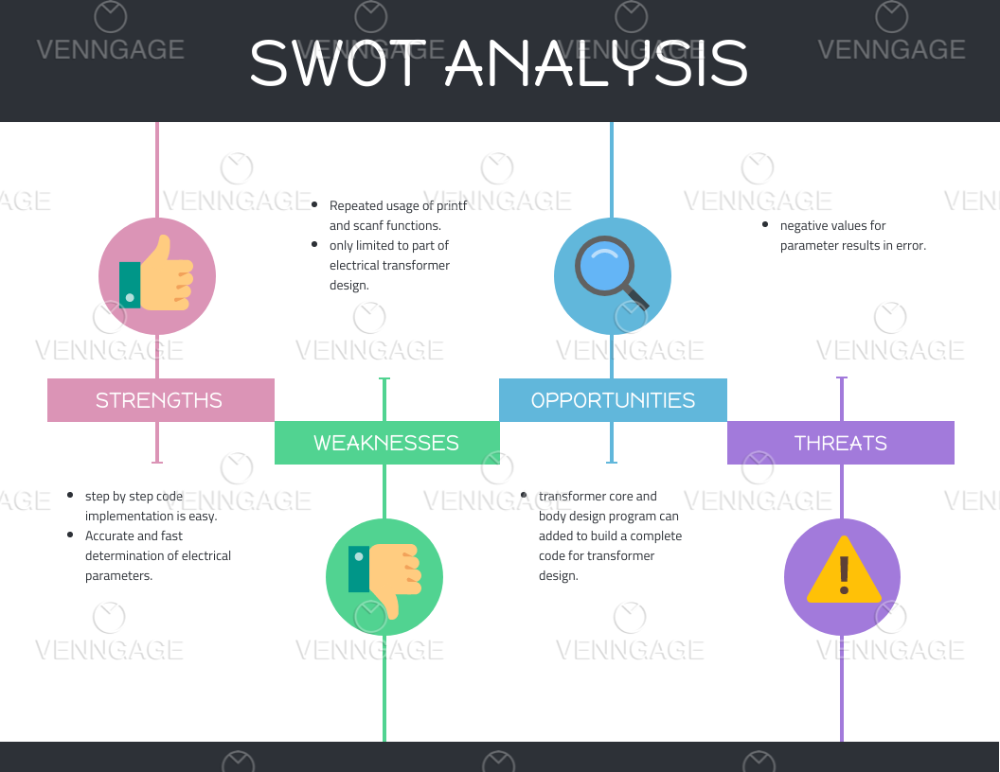

# Requirements
## Introduction
* A Electrical transformer is a passive electrical device that transfers electrical energy from one circuit to another through the process of electromagnetic induction. It is most commonly used to increase ('step up') or decrease ('step down') voltage levels between circuits.
* Transformer ratio is defined as nummber of turns of primary coil to number of turns of secondary coil.Transformer ratio is used to measure either of winding voltages or number pf turns needed.

 
## Defining our system
### Explanation
Program is build to design the transformer as desired.
calculates Turns ratio based on data.Turns Ratio=(primary number of turns)/(secondary number of turns).
Program takes general input data,then depending on the parameter like number of primary turns,primary voltage,secondary turns for desired secondary voltage is determined.
Transformer voltage,current and turns relationship is given by,

## SWOT Analysis

# 4W&#39;s and 1&#39;H

## Who:
* Electrical engineering people can use this program to easily calculate the parameters.

## What
* Project is all about transformer parameters relation

## When
* This is basic concept about transformer,c program for this concept in own way needs to be finished by 16th apr 2021.
## Where
* Entire project is built in online GDB and uploaded in Github through VS
## How
* After studying the technical concept step by step coding is done.

# Detail requirements
## High Level Requirements: 
| ID | Description | Category | 
| ---- | ----- | ------- | 
|HR01| **N1**-Number of primary turns| Technical|
HR02| **N2**-Number of secondary turns| Technical|
|HR03| **V1**-Primary voltage| Technical|
|HR04| **V2**-secondary voltage| Technical|
|HR05| **I1**-Primary current| Technical|
|HR06| **I2**-secondary current| Technical|
## Low Level Requirements: 
| ID | Description | HLRID | 
| ---- | ----- | ------- | 
|LR01| Number of conductor wire wound on primary side to induce primary voltage|HR01|
|LR02|Number of conductor wire wound on secondary side to induce secondary output voltage|HR02|
|LR03|Primary voltage in volts applied to transformer|HR03|
<<<<<<< HEAD
|LR04|Secondary voltage in volts where load is connected|HR04|
=======
|LR04|Secondary voltage in volts where load is connected|HR04|
>>>>>>> 885d6b5b81dbc4be737752a332a9d18735e8cd90
